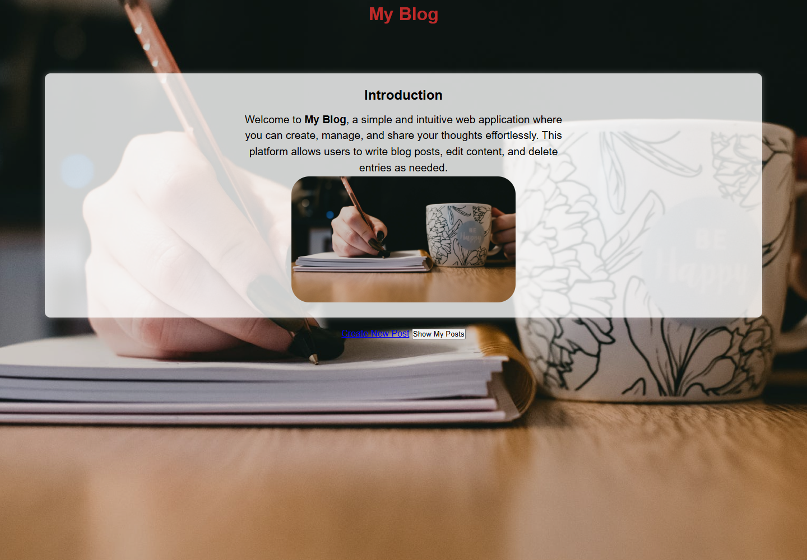
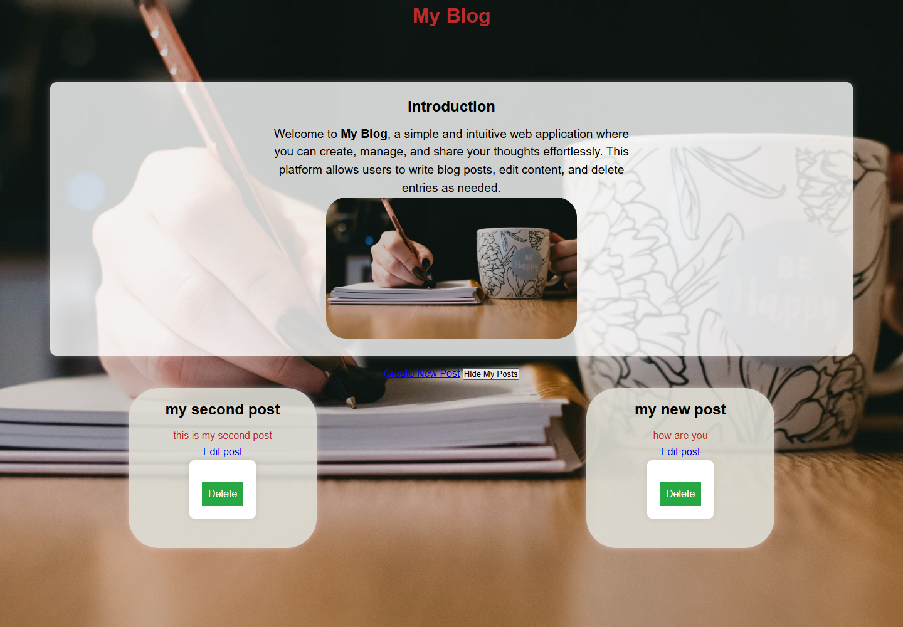

# My Blog
INTERN ID:-CITS3485
A simple full-stack blog application built with Node.js, Express, EJS, and
PostgreSQL. It supports creating, viewing, editing, and deleting blog posts
through a browser-based interface.

## Features

- Create blog posts with a title and content
- Load and show posts without refreshing the home page
- Edit existing posts
- Delete posts
- Store posts persistently in PostgreSQL
- Responsive styling with static CSS and image assets
- Configuration for deployment as a Vercel Node.js function

## Screenshot

Below is a screenshot of the working blog application:



You can also view the posts screen:



## Create Post Page

To create a new blog post, open the `/new` route in your browser or click the
Create Post link from the home page. The page shows a simple form with fields
for the post title and content.

Once submitted, the form sends a `POST` request to `/add`, which inserts the new
post into the PostgreSQL database and returns you to the blog interface.

If you want, you can add a dedicated screenshot for this page as
`docs/screenshots/03-create-post.png` and it will display here automatically.

## Tech Stack

- **Runtime:** Node.js
- **Server:** Express
- **Templates:** EJS
- **Database:** PostgreSQL using `pg`
- **Frontend:** HTML, CSS, and browser JavaScript
- **Configuration:** `dotenv`
- **Deployment:** Vercel

## Requirements

Install the following before running the project locally:

- Node.js 18 or newer
- npm
- PostgreSQL

## Local Setup

1. Clone the repository and enter the project directory:

   ```bash
   git clone https://github.com/vaibhav486/new-blog.git
   cd new-blog
   ```

2. Install dependencies:

   ```bash
   npm install
   ```

   If PowerShell blocks `npm.ps1` on Windows, use:

   ```powershell
   npm.cmd install
   ```

3. Create a PostgreSQL database:

   ```sql
   CREATE DATABASE blogapp;
   ```

4. Connect to the database and create the `posts` table:

   ```sql
   CREATE TABLE posts (
       id SERIAL PRIMARY KEY,
       title TEXT NOT NULL,
       content TEXT NOT NULL
   );
   ```

5. Copy `.env.example` to `.env` and update the values for your PostgreSQL
   installation:

   ```env
   DB_USER=postgres
   DB_HOST=localhost
   DB_NAME=blogapp
   DB_PASSWORD=your_postgres_password
   DB_PORT=5432
   ```

   The example file currently uses port `5433`; use the port on which your
   PostgreSQL server is actually listening. The usual PostgreSQL default is
   `5432`.

6. Start the application:

   ```bash
   npm start
   ```

   On Windows, `npm.cmd start` can be used if PowerShell script execution is
   disabled.

7. Open [http://localhost:3000](http://localhost:3000).

The application uses the `PORT` environment variable when it is defined and
otherwise runs on port `3000`.

## How It Works

The home page is rendered by EJS. Posts are initially hidden and are fetched
from `/get-posts` when **Show My Posts** is selected. Create, update, and delete
forms submit requests to the Express server, which runs parameterized SQL
queries against PostgreSQL.

Posts are ordered by descending ID, so the newest post normally appears first.

## Routes

| Method | Route | Purpose |
| --- | --- | --- |
| `GET` | `/` | Render the home page |
| `GET` | `/get-posts` | Return all posts as JSON |
| `GET` | `/new` | Render the new-post form |
| `POST` | `/add` | Create a post |
| `GET` | `/edit/:id` | Render the edit form for a post |
| `POST` | `/update/:id` | Update a post |
| `POST` | `/delete/:id` | Delete a post |

## Project Structure

```text
blog-application/
|-- public/
|   |-- script.js       # Fetches, displays, and toggles posts
|   |-- styles.css      # Application styling
|   `-- images          # Static image assets
|-- views/
|   |-- index.ejs       # Home page
|   |-- new.ejs         # Create-post page
|   `-- edit.ejs        # Edit-post page
|-- .env.example        # Environment variable template
|-- db.js               # PostgreSQL connection pool
|-- index.js            # Express application and routes
|-- package.json        # Dependencies and npm scripts
`-- vercel.json         # Vercel build and routing configuration
```

`posts.json` is sample data and is not used by the running application.
PostgreSQL is the application's source of truth.

## Deployment on Vercel

The repository includes `vercel.json`, which sends all routes to `index.js`.
The Express app is exported for Vercel and only calls `app.listen()` when run
directly.

Before deploying:

1. Provision a PostgreSQL database that accepts connections from Vercel.
2. Create the `posts` table using the schema above.
3. Add `DB_USER`, `DB_HOST`, `DB_NAME`, `DB_PASSWORD`, and `DB_PORT` in the
   Vercel project's environment variables.
4. Deploy the repository through the Vercel dashboard or CLI.

Do not commit `.env`. It is ignored by Git and may contain database
credentials.

## Current Limitations

- There is no authentication, so every visitor can create, edit, or delete
  posts.
- There is no automated test suite; the current `npm test` script intentionally
  exits with an error.
- The browser inserts post content using `innerHTML`. Treat stored content as
  untrusted and add output sanitization before exposing the app publicly.
- Validation is limited to required HTML fields and empty-string fallbacks on
  the server.
- The application does not include database migrations or automatic table
  creation.

## License

This project is currently declared under the ISC license in `package.json`.
